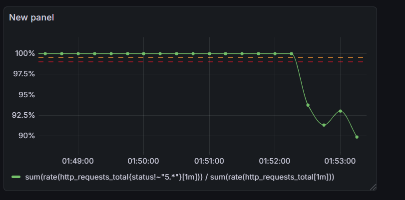

# 📉 SRE Sandbox: Observability & Chaos Engineering Demo

**A practical demonstration of Site Reliability Engineering (SRE) principles using Python, Docker, Prometheus, and Grafana.**

## 📖 Overview
This project simulates a real-world microservice environment to practice "observability driven" development. 

Instead of a perfect "Hello World" app, this repository contains **"The Unstable API"**—a Python service designed to fail randomly. The goal of the project is not just to run the app, but to **monitor it, break it, and fix it** using industry-standard SRE tools.

### Key Concepts Demonstrated:
* **SLIs & SLOs:** Measuring Service Level Indicators and visualizing Objectives.
* **Telemetry:** Instrumenting a Python API to expose Prometheus metrics.
* **Infrastructure as Code:** Using Docker Compose to spin up a full monitoring stack.
* **Chaos Engineering:** Using load testing scripts to intentionally trigger SLO breaches.

## 🛠 Tech Stack
* **Application:** Python (FastAPI)
* **Containerization:** Docker & Docker Compose
* **Metric Storage:** Prometheus
* **Visualization:** Grafana
* **Scripting:** Python (`requests` for load testing)

## 🚀 How to Run

1. **Clone the repository:**
   ```bash
   git clone [https://github.com/YOUR_USERNAME/sre-sandbox.git](https://github.com/YOUR_USERNAME/sre-sandbox.git)
   cd sre-sandbox

2. **Launch the Stack: Spin up the API, Prometheus, and Grafana in detached mode.**
    ```bash
    docker-compose up -d --build

3. **Access the Dashboards:**
    - API: http://localhost:8000
    - Prometheus: http://localhost:9090
    - Grafana: http://localhost:3000 (Login: admin / admin)


## 🧪 The Experiment (Chaos Mode)
The repository includes a load testing script to simulate a traffic spike and trigger latent bugs.

1. **Start the Load Test:**
    ```bash
    python load_test.py

This script hits the /risky endpoint, which has a 20% chance of throwing a 500 error.

2. **Observe the SLO Breach:**
Go to Grafana and watch the "Success Rate" drop below the 90% threshold.



3. **Fix the Issue:**
Update main.py to patch the random failure, rebuild the container, and watch the graph recover to 100%.

## 📂 Project Structure

sre-sandbox/
├── main.py              # The Unstable API
├── Dockerfile           # Container logic
├── docker-compose.yml   # Stack orchestration
├── prometheus.yml       # Metrics configuration
└── load_test.py         # Chaos script